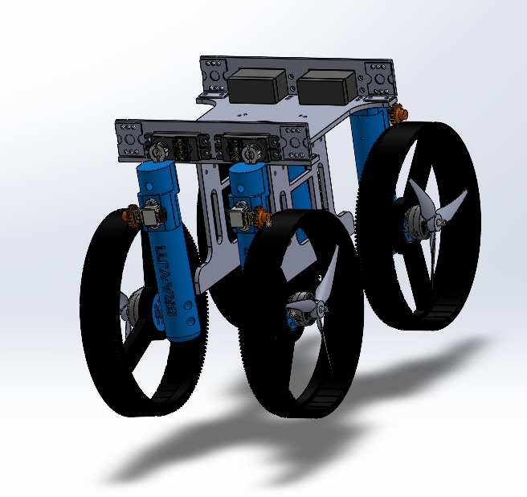
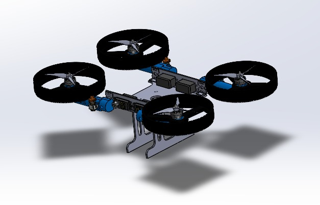

# Mechanical Design and Actuation

Mechanical design is an essential stage in the development of any robot. The robot's future prospects are influenced by how it is designed. 

##  Mechanical Design

__Modular Design__: The EvoBorne's chassis is built of lightweight yet robust components like aluminium and 3D printed PLA parts. The EvoBorne's mainframe is made of aluminium that houses the electronics assembly. The arms and wheels are 3D printed and attached through the servos mounted on the mainframe. 

This modular design facilitates part replacement and maintenance, as well as adaptability to varied configurations for specialized applications or situations.

__Frame and Structure:__

Designing the morphobot was a major task ; as it was to be tailor-made to perform in multiple modes ( aerial & terrestrial ). It was designed keeping in mind the following factors :
1. Terrestrial motion : When traversing on land , the EvoBorne needs to be stable enough to continue smooth motion at moderate velocity on diverse terrain. That meant ensuring the chassis was perfectly balanced in terms of size & weight . Also ,the morphing process was also to be considered;it should be able to morph & unmorph efficiently without any damage to itself or the surroundings. The wheels needed to be large enough to encase the propellers but small enough to maintain a stable COM. 

2. Flight : Flying the EvoBorne was the most critical point while designing the EvoBorne . Even a slight discrepancy in the geometry could affect its flying capabilities fatally. The thrust-to-weight ratio was also taken into consideration while designing the frame. It has a H-airframe 

### Actuation

Wheel and Drone Components:

Wheels and Motors: For ground mobility, the morphobot is equipped with small, powerful brushless DC motors, possibly the N20 motor type, known for their compact size and high torque output. The wheels are designed to be lightweight with a durable tread capable of handling different terrains.
    Propellers and ESCs: In drone mode, the propellers are deployed. These are driven by brushless motors controlled by 4-in-1 ESCs (Electronic Speed Controllers), which manage the speed and direction of each motor to control flight dynamics such as lift, pitch, roll, and yaw.

Actuation and Transition:

- Servo Motors: 
    - Servo motors are critical for the transformation process, providing precise control over the transition process to switch between the EvoBorne's two forms. They must be robust enough to handle the mechanical stress from the thrust when in drone mode and responsive enough to ensure a smooth transition. 
    - We have used OT5325 servo motors for the EvoBorne that provide a stall torque of 25 kg-cm when operating at 7.4V ; this is essential to ensure that the arms of the EvoBorne do not tilt due to thrust from the propellers. 
- N20 motors:
    - The EvoBorne utilizes these motors to perform terrestrial motion. These motors are connected to the wheel through a spur gear system ; one gear on the shaft and the other on the wheel's circumference. This system is a high-torque,low-speed system that will provide better traction on all surfaces.
- Brushless BLDC motors :
    - The EvoBorne uses Emax ECOII-2807-1700KV BLDC motors for flight . These motors have a 1700 Kv (rpm/volt) rating and are controlled via the 4-in-1 ESC. It uses 6' propellers 

- Locking Mechanisms: Reliable locking mechanisms are essential to ensure stability in both modes. These might include magnetic locks or mechanical latches that secure moving parts once the transformation is complete.

Stability and Maneuverability:

In summary, the mechanical design of the morphobot is a sophisticated blend of robotics engineering, combining elements from both aerial and terrestrial technologies to create a versatile and dynamic machine capable of operating in diverse environments and fulfilling a range of tasks. This design not only challenges existing engineering practices but also pushes the boundaries of what is technically feasible in robotic transformations.
